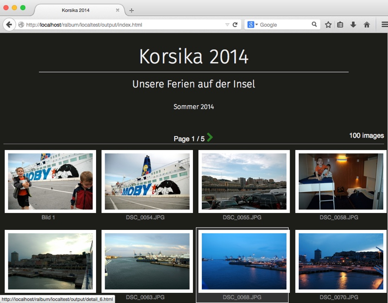
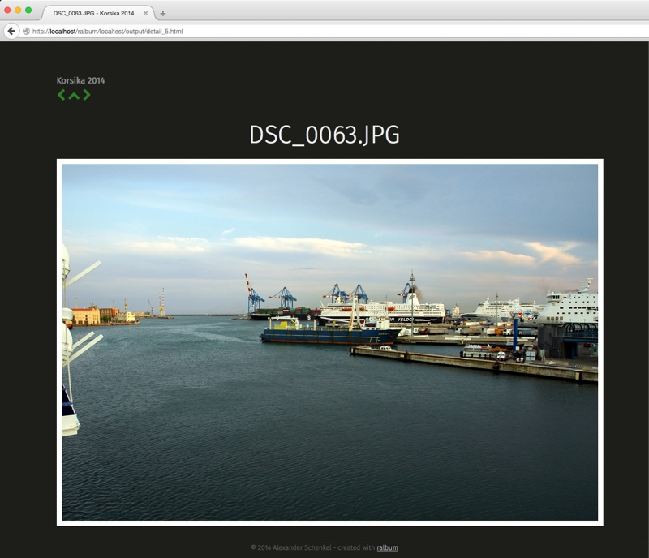

# ralbum - a static web album generator written in ruby

> ralbum is a (command line) tool to create a static HTML web album from a folder containing images. It is completely file-based and does not 
destroy the original images.

> Note that this library is in a VERY EARLY development stage and is not yet fully functional.

ralbum is for people who:

* are not afraid of editing config files
* need a database-independent, VCS-aware static web album
* don't want to fiddle with thousands of settings but just want a simple web album

## Features

* Creates static Web Albums from a bunch of images
* Creates Index pages with configurable nr of images per index page
* Creates detail pages for each image
* HTML templates based on ERB-templates
* simple JSON configuration files for the album and the images
* Each template can define its own formats like thumbs, detail sizes etc
* Support for index-only albums for JavaScript-based image galeries
* Support for index pages, like this:
  
* Support for detail pages, like this:
  

You can watch a published demo at http://bylexus.github.io/ralbum/demo/output/

## Requirements

* ruby >= 2.0
* ruby bundler - <code>gem install bundler</code>
* The ImageMagick library
  * OS X using MacPorts: <code>sudo port install imagemagick</code>

## Installation

    gem install bundler
    bundle install

## Getting started

1. cd into your image directory
   `cd my-images/`

2. create the album
   `ruby ralbum.rb create --title "My holiday pictures"`

3. publish the album
   `ruby ralbum.rb publish --to /path/to/static/output/`

## In-detail: Usage

For now, there is no executable available, so use it using ruby for now: 

<code>ruby ralbum.rb</code>

### Getting command overview

<code>ruby ralbum.rb help</code>

### Create album

<code>ruby ralbum.rb create [--title STRING] [--subtitle SRING] [--description STRING]</code>

The <code>create</code> command initializes the album in the current directory. This is the directory where your original images should be stored. A bunch of JSON file will be created, your original images won't be modified.

### Publish album

<code>ruby ralbum.rb publish [--to PATH] [--template NAME|PATH] [--force]</code>

Publishes the final web album:

* <code>--to</code> defines the output path. All files and images are copied to this folder. Existing files will be overwritten.
* <code>--template</code> defines the html template to use. At the moment, this is mandatory. Use the example in <code>templates/white</code> for now.
* <code>--force</code> re-recreates all images in the destination, even if they already exist. Otherwise, only generate new images.
## album.json format

Just a brain dump for now:
```
{
    "image_dir": "images",
    "images": {
        "thumb": {
            "dimension": "200x150",
            "format":"jpeg"
        },
        "detail": {
            "dimension": "1024x768",
            "format":"png"
        }
    },
    "index": {
        "pagesize":5,
        "filename_template": "index<%= page_nr if page_nr > 1 %>.html"
    }
}

```

... TO BE CONTINUED ...
